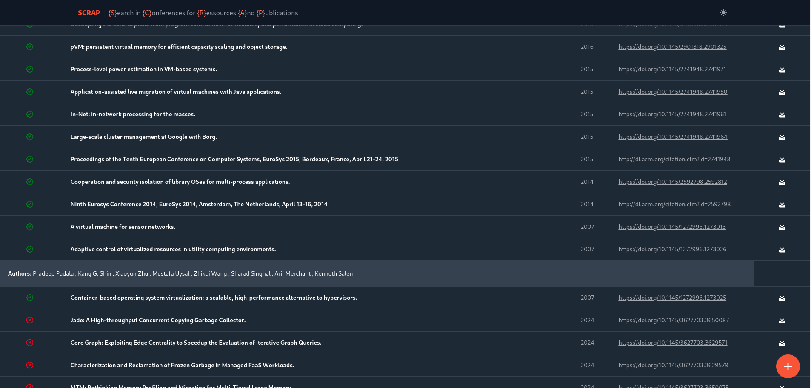

# SCRAP: {S}earch in {C}onferences for {R}essources {A}nd {P}ublications



Allows you to find conferences as well as all their papers. But above all: find papers that match your keywords with ChatGPT. You can also export the list to CSV format.

## Installation

1. Install bun https://bun.sh/
2. Install dependencies with
```shell
bun install
```
On Windows, you may have to run:
```shell
bun install @rollup/rollup-win32-x64-msvc
```
3. Copy `.env.example` to `.env` and fill with your own data

## Run project

2. Run
```shell
bun dev
```
3. Access http://localhost:8010/